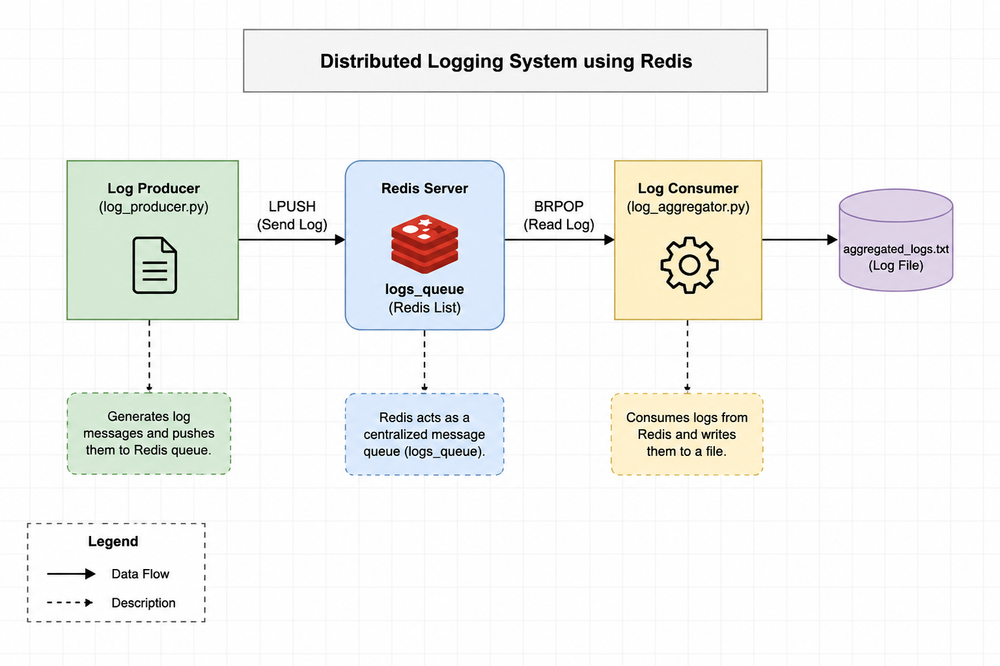

# Distributed Logging System using Redis

A DevOps project demonstrating a producer-consumer distributed logging architecture using Redis as a centralized message queue on AWS EC2.

Built as part of the **DevOps + SRE Daily Challenge Series**.



---

## Overview

This project demonstrates a simple distributed logging system where log producers push messages into a Redis queue and a consumer continuously processes and persists them.

The system consists of:

- A log producer that generates and queues log messages
- Redis acting as a centralized message queue
- A log consumer that processes incoming logs in real time
- Persistent log storage in `aggregated_logs.txt`

---

## Architecture

```
Log Producer          MacBook / EC2
(log_producer.py)
        │
        ▼
Redis Queue           AWS EC2 (Ubuntu)
(logs_queue)
        │
        ▼
Log Consumer
(log_aggregator.py)
        │
        ▼
aggregated_logs.txt
```

---

## Project Structure

```
redis-distributed-logging/
├── log_producer.py
├── log_aggregator.py
├── requirements.txt
├── README.md
├── .gitignore
└── screenshots/
```

---

## Environment

| Component | Details |
|---|---|
| Cloud Provider | AWS |
| Compute | EC2 (Ubuntu) |
| Message Queue | Redis |
| Client Tool | redis-cli, Python |

---

## Setup

### 1. Install Redis

```bash
sudo apt update && sudo apt install redis-server -y
redis-server --version
```

### 2. Configure Redis

Edit `/etc/redis/redis.conf`:

```
# Enable password authentication
requirepass Redis@123

# Allow external connections
bind 0.0.0.0
```

Restart and verify:

```bash
sudo systemctl restart redis-server
sudo systemctl status redis-server
```

### 3. Authenticate and Test

```bash
redis-cli
AUTH Redis@123
PING    # Expected: PONG
```

### 4. Test Remote Connectivity

From a local machine:

```bash
redis-cli -h <EC2_PUBLIC_IP> -p 6379
AUTH Redis@123
PING    # Expected: PONG
```

> Make sure port `6379` is open in your AWS Security Group inbound rules.

---

## Log Producer

The producer script connects to Redis and pushes log messages into the queue.

```bash
python log_producer.py "INFO: Application Started"
```

Internally it:

- Connects to Redis and authenticates
- Pushes the log message into `logs_queue` using `LPUSH`

---

## Log Aggregator

The consumer continuously listens for new messages and writes them to a log file.

```bash
python log_aggregator.py
```

Responsibilities:

- Wait for new messages using `BRPOP` (blocking pop)
- Remove processed logs from the queue atomically
- Append each log entry to `aggregated_logs.txt`

---

## Distributed Logging Workflow

```
1. Producer generates a log message
2. Message pushed into Redis via LPUSH
3. Redis stores it in logs_queue
4. Consumer blocks on BRPOP, waiting for new entries
5. Consumer retrieves and removes the message
6. Message appended to aggregated_logs.txt
```

---

## Key Learnings

- Redis installation and service management on EC2
- Password-based authentication using `requirepass`
- Difference between binding to `127.0.0.1` vs `0.0.0.0`
- AWS Security Group configuration for external access
- Redis Lists as message queues (`LPUSH`, `BRPOP`, `LLEN`, `LRANGE`)
- Producer-consumer architecture and decoupled system design
- Log aggregation and persistent storage concepts
- Remote connectivity testing using `redis-cli`

---

## Screenshots

| Screenshot | Description |
|---|---|
| `redis-version.png` | Redis installation verified |
| `redis-running.png` | Redis service status |
| `redis-auth-ping.png` | Authentication and PING test |
| `queue-length.png` | Queue length after LPUSH |
| `queue-content.png` | Queue contents via LRANGE |
| `producer-output.png` | Producer sending log messages |
| `consumer-output.png` | Consumer processing log messages |
| `aggregated-logs.png` | Final aggregated log file |

---

## Author

**Manik Singhal**
